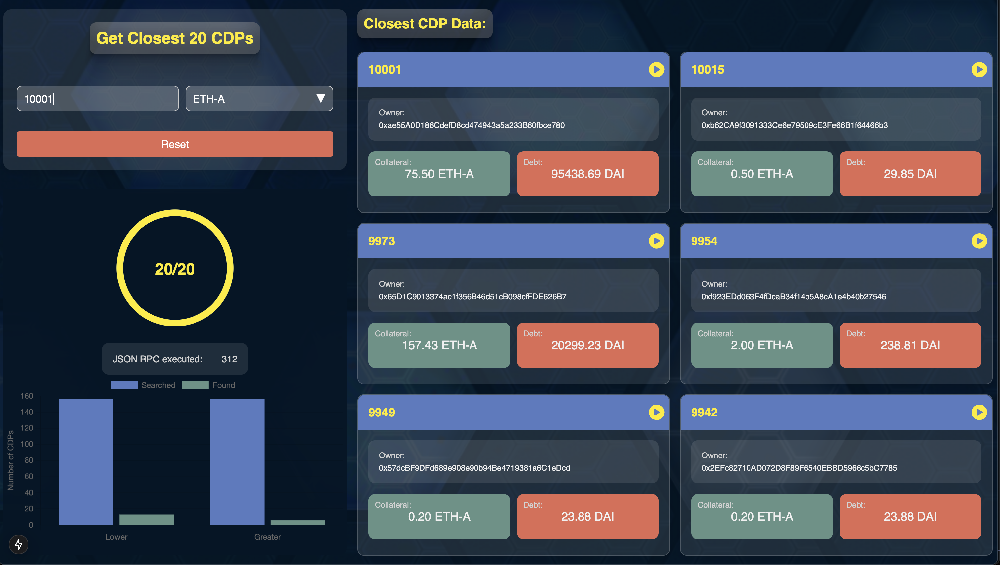
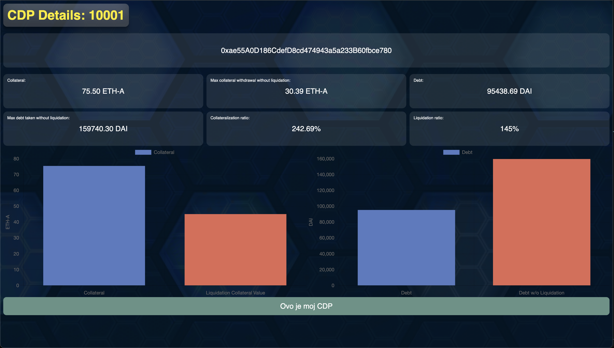
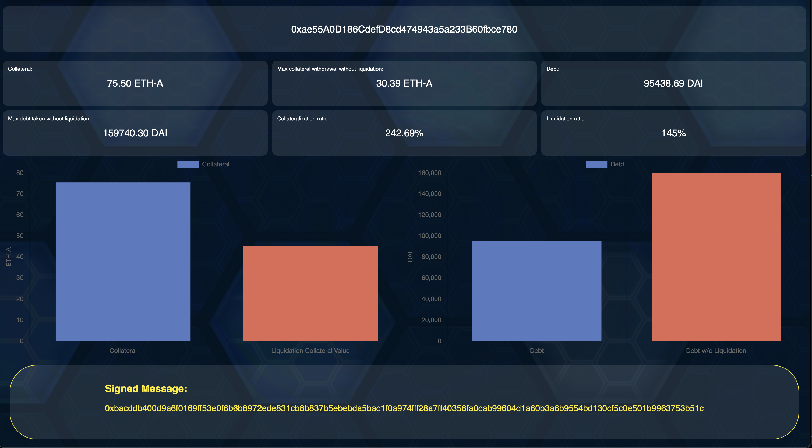

This is a [Next.js](https://nextjs.org) project bootstrapped with [`create-next-app`](https://nextjs.org/docs/app/api-reference/cli/create-next-app).

## Getting Started

First install dependencies with `npm install`, then run the development server:

```bash
npm run dev
# or
yarn dev
# or
pnpm dev
# or
bun dev
```

Open [http://localhost:3000](http://localhost:3000) with your browser to see the result.

You can start editing the page by modifying `app/page.tsx`. The page auto-updates as you edit the file.

## Description 
Defind is a small nextjs application about searching collaterized debt positions based on an input id data.

## Use
Use is able to input a cdpId number into input field on the home page and after that to wait for application to find the closest 20 cdp by id based on input value data.


Every cdp found is having a detail page where more data about collaterized debt position are displayed.


On detail page user is available to sign the message via metamask browser extension for digital wallet data.
